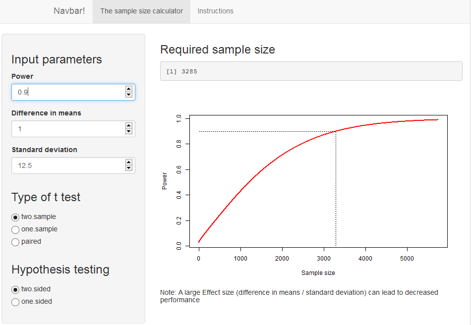

The sample size calculator
========================================================
author: Zanin Pavel
date: 5/02/2016
autosize: true


About app
========================================================
Power analysis and sample size calculation are important planning stage of the experiment, because without these calculations, the amount of data may be too large or too small to obtain reliable results.    
If the sample size is too small, you have small probability that you have carried out an experimental research (mass survey, etc.) will give reliable results. On the contrary, if the sample size is too large, the time spent on data collection and large financial costs associated with it, will not bring the expected effect.  

Web app "Sample size calculator"  will help you to solve this task!    

More detail you can get in "Introduction" page in app.

App screenshot
========================================================




App's settings
========================================================

Parameters meaning in calculator:     
1) Power - power of test (1 minus Type II error probability)     
Power is usually fixed at 80%, 90% or 95%. Power must not be less than 80%.    
2) The effect size - the difference in the means in standard deviation units (difference in the means / standard deviation).    
3) Type of t test.   
4) One- or two-sided test.


Main function for calculating   
========================================================


```r
calcSize <- round(power.t.test(power = 0.9, 
                 delta = 1, 
                 sd = 12.5, 
                 type = 'two.sample', 
                 alt = 'two.sided')$n , 0)
calcSize
```

```
[1] 3285
```
     

Links
========================================================

[Link to project on GitHUB](https://github.com/Filareth2015/Data-products-development)     

[Link to app on Shinyapp](https://zaninpy.shinyapps.io/Sample_size_calculation/)
